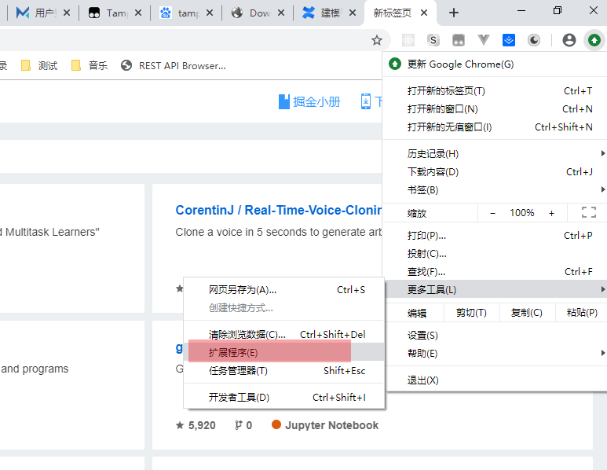
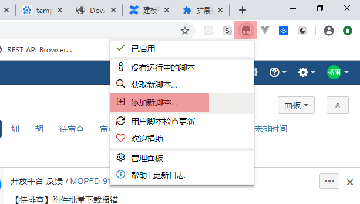
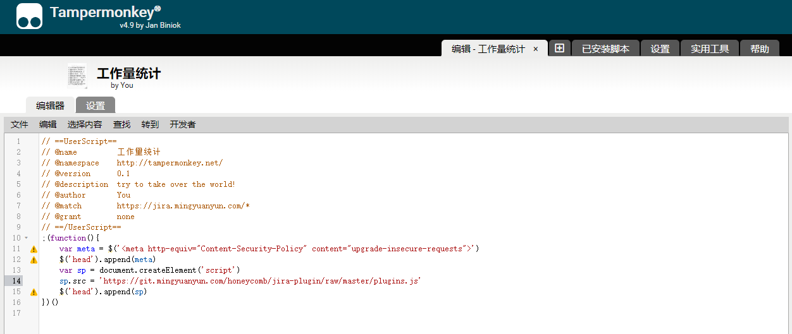
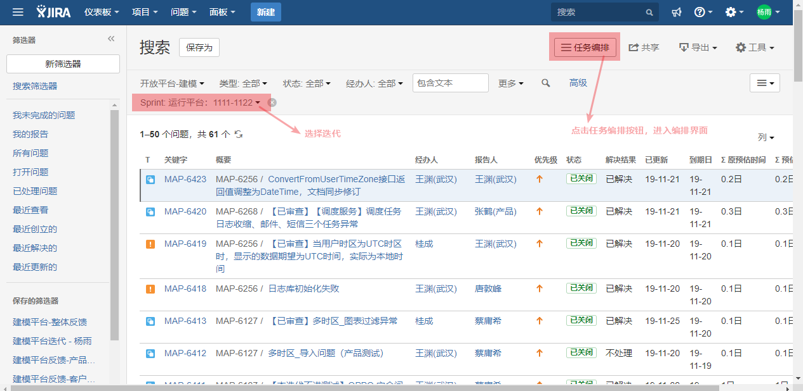
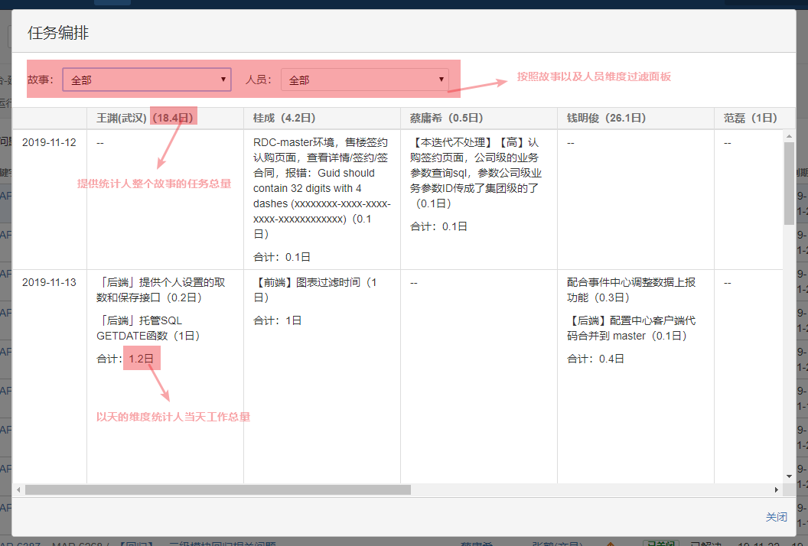
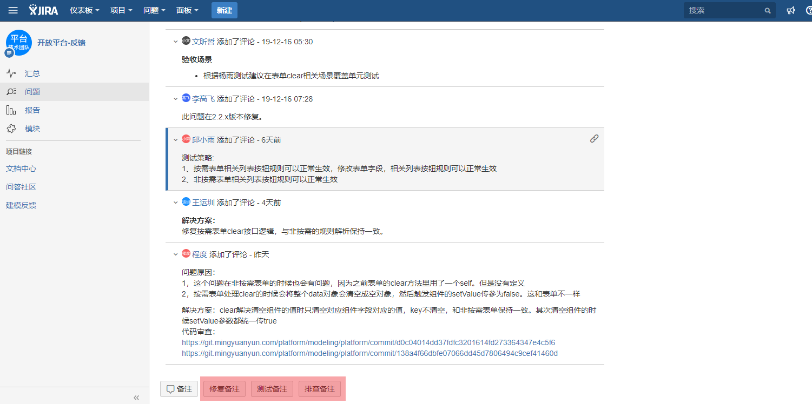
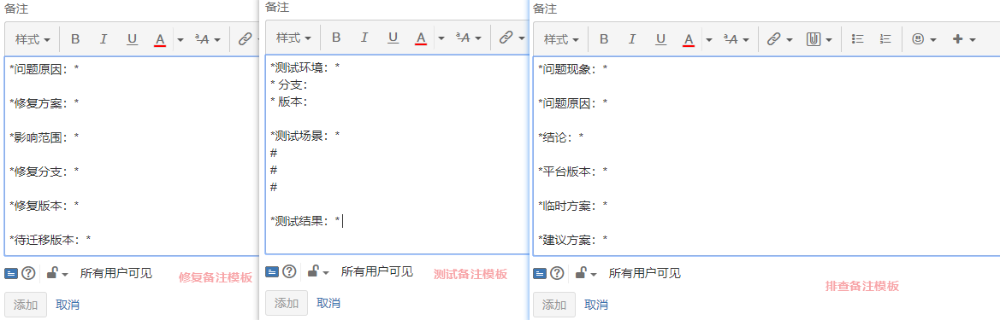
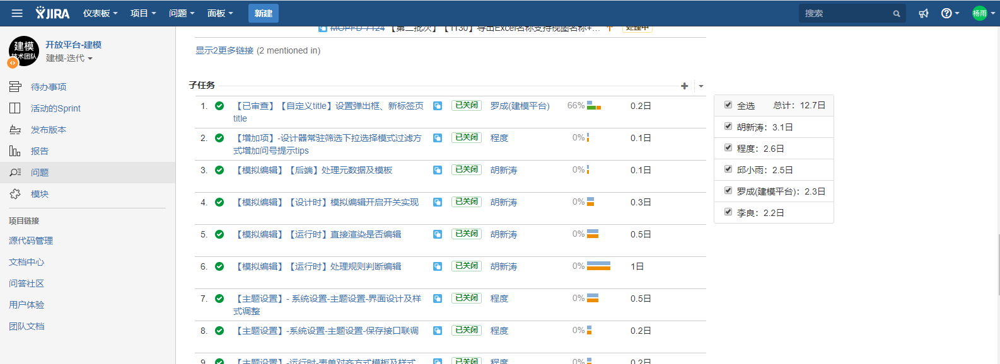

# jira提效插件使用文档

jira管理迭代的故事目前存在无法很快的统计每个开发或者每个故事的开发量，在迭代初期会花费大量的时间去调整和规则每个人的开发节奏和开发量，为了减少在规划上的耗时，根据实际的业务和场景基于jira系统开发了一款浏览器插件。

### 工具价值及提效场景

通过这个jira小工具，可以提升一下角色的工作效率：

PO: 可以直观的看到整体故事的耗时情况，初步识别风险点

SM：可以了解每个故事，各个开发之间的协调情况，合理的安排规划资源

开发：快速了解迭代内故事的配合情况，以及相关节点时间安排

测试：根据故事的安排情况，合理的规划在各个节点时的测试安排

## 使用说明

### 安装浏览器Tampermonkey插件
- 使用前需要下载Tampermonkey浏览器插件，[点击下载](./docs/dhdgffkkebhmkfjojejmpbldmpobfkfo-4.9-Crx4Chrome.com.crx)

- 下载后需要安装插件到chrome浏览器扩展程序，如图：



进入扩展程序界面之后，需要将加载下来的插件进行安装，如图：


### 录入Tampermonkey插件脚本

- 进入Tampermonkey插件脚本添加界面，如图：



- 保存以下脚本到Tampermonkey，如图：
- 
``` javascript
// ==UserScript==
// @name         工作量统计
// @namespace    http://tampermonkey.net/
// @version      0.1
// @description  try to take over the world!
// @author       You
// @match        https://jira.mingyuanyun.com/*
// @grant        none
// ==/UserScript==
;(function(){
    var meta = $('<meta http-equiv="Content-Security-Policy" content="upgrade-insecure-requests">')
    $('head').append(meta)
    var sp = document.createElement('script')
    sp.src = 'https://git.mingyuanyun.com/honeycomb/jira-plugin/raw/master/plugins.js'
    $('head').append(sp)
})()
```



注意：按住ctrl+s保存

### 基于筛选结果按人以及故事维度统计任务量

进入jira搜索页面，这时会看到右上角操作栏会有任务编排按钮，通常需要我们搜索当前迭代后再来点击任务编排按钮，因为编排的数据是依赖上诉过滤条件的结果，操作如下：



点击后，会以对话框方式打开任务编排界面，如图：



当前界面提供了如下信息以及操作：

- 可以按照故事以及参与人员方式进行数据的过滤
- 可以按照故事的维度分析参与人员整个迭代的任务总量
- 可以按照日期的维度分析参与人员在某一天的任务总量是否合理


### 一键修改任务状态

通过在任务工具栏增加状态菜单操作按钮，可以一键修改任务的状态，不需要再次手动录入节省时间，如图：


### 增加任务备注模板

同一个任务不同的角色需要备注的内容也不同，为了统一和标准备注的内容，在任务的底部增加了修复备注、测试备注、排查备注模板，如图：



点击备注按钮后，输入框中会自动填充备注模板：



### 子任务类别增加时间字段显示，并且按照人的维度统计工作量

目前jira故事中的子任务并没有清晰的给出具体的耗时时间和参与故事人的工作量统计，针对这些痛点，在界面子任务列表旁边增加统计以及子任务列表增加耗时字段，如图：



### 后续规划

- 后续考虑通过开发jira插件的方式，是安装更加便捷，无需安装浏览器插件
- 风险预警，如哪个参与人员的任务总量溢出，给出友好提示
